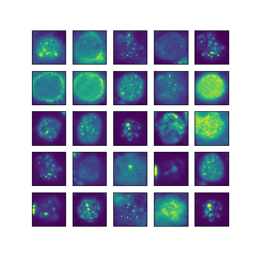
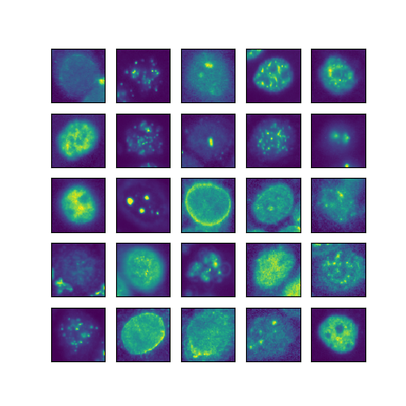
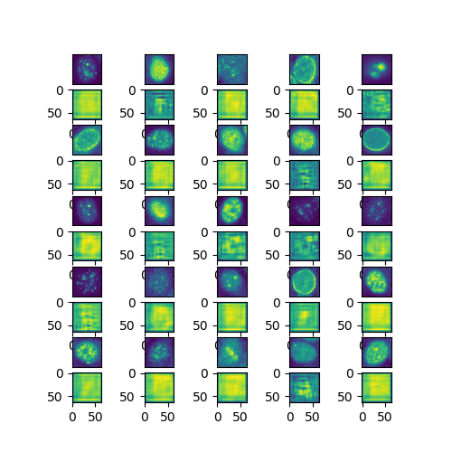
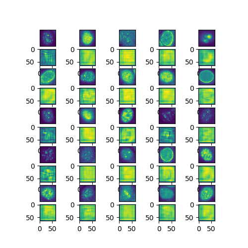

# ATA-GAN

Demo code for our paper  on <a href="http://arxiv.org/abs/1802.09070"> Attention-Aware Generative Adversarial networks (ATA-GANs)- ArXiv- Sumbitted to  </a>: <a href="http://ivmsp2018.org/"> IVMSP 2018</a>
 

<strong> Abstract: </strong> A new family of generative models named as Generative Adversarial Networks (GANs) has been proposed. Using two neural networks (one that generates samples and one that evaluates them as real or fake), these networks are able
to learn a mapping between an input domain and the actual data. However, the ability of the generator to locate the regions
of interest has not been studied yet. In this context, here, we are using GANs in order to generate images from HEp-2 cells
captured with Indirect Imunofluoresence (IIF) and study the ability of the discriminator to perform a weekly localization of the cell. Our contribution is four-fold. First, we demonstrate that whilst GANs can learn the mapping between the input
domain and the target distribution efficiently, the discriminator network is not able to detect the regions of interest. Secondly, we present a novel attention transfer mechanism which allows us to enforce the discriminator to put emphasis on the regions of interest via transfer learning. Thirdly, we show that this can generate more realistic images, as the discriminator learns to put emphasis on the area of interest. Fourthly, the proposed method allows one to generate both images as well as attention maps which can be useful for data annotation e.g in object detection.

 
 

Citation:  
<a href="www.upcv.upatras.gr/personal/kastaniotis">Dimmitris Kastaniotis</a>, Ioanna Ntinou, Dimitris Tsourounis, <a href="www.upcv.upatras.gr/personal/economou">George Economou and <a href="www.upcv.upatras.gr/personal/fotopoulos">Spiros Fotopoulos</a>, Attention-Aware Generative Adversarial Nerworks (ATA-GANs), arXiv:1802.09070v1 [cs.CV]

## Some Results:

## Generated versus Real images.

Below, you can see some generated (Left) as well as some real (genuine) images (Right):  

  

 
 
 
 ## Discriminator Attention Maps.
 
 Below, you can see some generated (Left) as well as some real (genuine) images (Right) together with the Soft-Class Activation Maps:  
 
  

 

## Demo Code (PyTorch)

## Try our models and compare with a regular discriminator:

Here we provide the steps required in order to evaluate our discriminator in HEp-2 cell validation images as well as to compare the ATA-GAN discriminator with a regular discriminator trained without Teacher-Attention loss.  
First, you need to download the data from <a href="https://www.dropbox.com/s/1mjnpwqfrk0au4b/ICPR2014_demoImages.zip?dl=0">here </a>  
After download, extract the data in ATA-GAN folder (where the python code is). This will create the following filepath `WithoutMasks/TrainVal/val` where in val folder there will be six folders corresponding to the six categories.
 
Then you will need the pretrained models. ATA-GAN models are available <a href="https://www.dropbox.com/s/ldn821j0kfdo7jj/ATAGAN_models.zip?dl=0"> here </a>. Regular GAN models are available <a href="https://www.dropbox.com/s/9o64m6d1jsk4tp6/PlainGAN_models.zip?dl=0"> here</a>
 
# Run the demo- Visualize discriminator Soft-CAM
- Prerequisities: Anaconda Python 3.6 and PyTorch installed using the instructions from the original site.
- First select the GAN model (ATA-GAN or Plain-GAN). Copy `*.pt` files into the folder where is located the `DemoATAGan.py`.
- Call the demo

     python DemoATAGan.py
    
    

